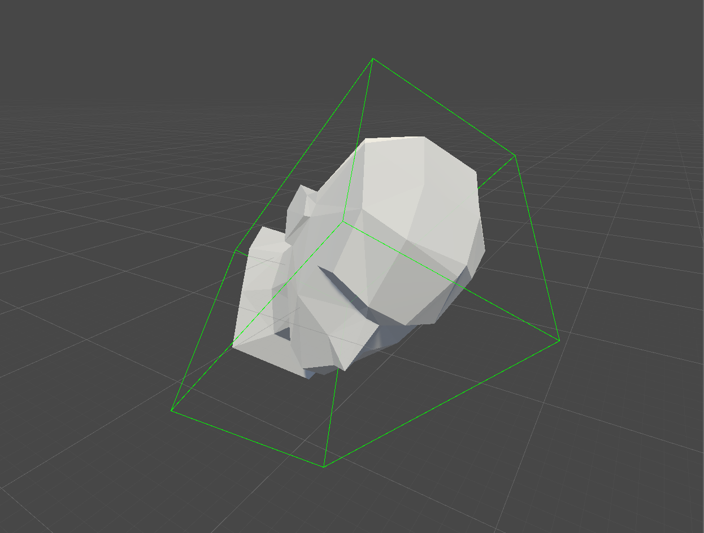

# RotatedBounds

An example on how to calculate bounds of a moved/rotated/scaled object in Unity.

Useful to know if you need to have accurate bounds of an object that is rotating. This data could be used for something like collision calculations.

I just wrote this as a test/reminder snippet for myself.

### Viewport visualization of the rotated bounds

